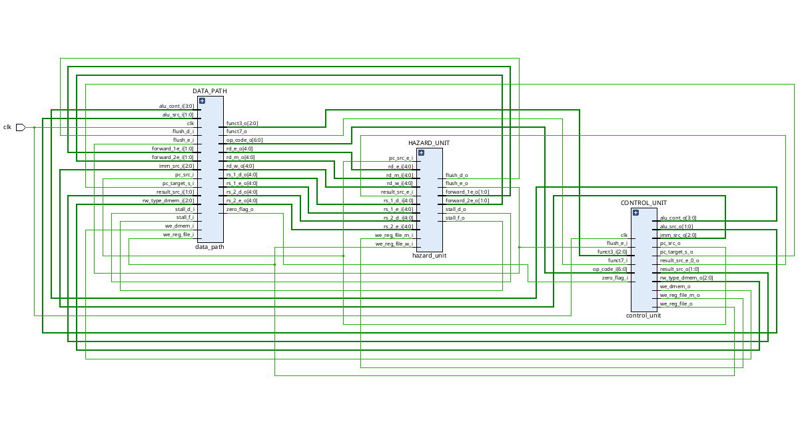


# RV32 Pipeline Processor
RISC-V processor with a 32-bit pipelined, including I-set instructions.

## Schematic Diagram
Below is the schematic diagram of the RV32 processor:

## Usage
1. You can add your ready-to-use 32-bit instructions into the `instructions.mem` file in the project directory.
2. Please check the path `.mem` file in the `inst_mem.v` 
